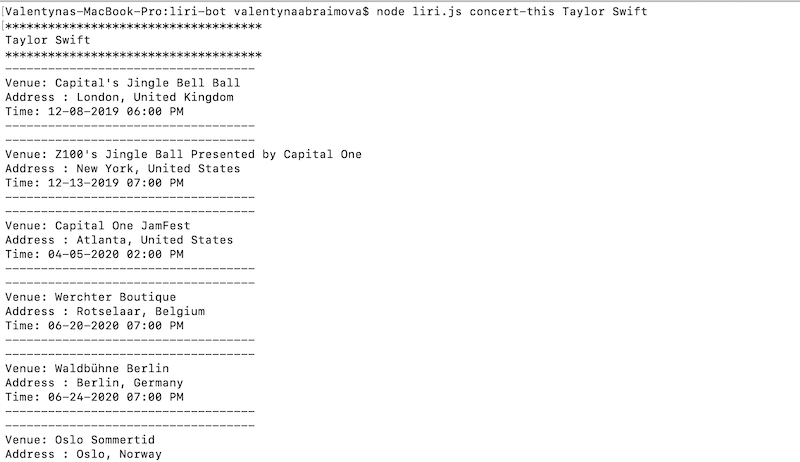
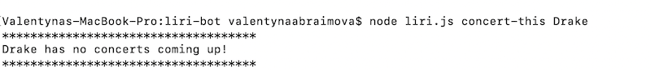

# LIRI BOT

## ABOUT

### Meet LIRI

LIRI is a command line node app that will search Spotify for songs, Bands in Town for concerts, and OMDB for movies.

I used switch statements to call an appropriate API based on user's input.

## INSTRUCTIONS

> Open the terminal in your root derictory. Once there, run these commands:

-- TO CHECK IF YOUR FAVORITE ARTIST HAS A CONCERT COMING UP --
```sh
$ node liri.js concert-this <artist/band name here>
```
--  TO GET INFO ABOUT A SONG --
```sh
$ node liri.js spotify-this-song <song name here>
```
-- TO GET INFORMATION ABOUT A MOVIE --
```sh
$ node liri.js movie-this <movie name here>
```
-- TO GET LIRI RUN THE COMMAND LISTED IN random.txt  --
```sh
$ node liri.js do-what-it-says
```
***
### !! IMPORTANT 
Do not wrap the artist, song or movie name in quotes.
***
***
### !! IMPORTANT 
to use this application,  run 
```sh
$ npm install in the root directory
```
***

## TECHNOLOGIES USED

- Node.js
- Axios
- Moment.js
- Spotify API
- OMDB API 
- Bands In Town API

## Examples:

### Search one:
```sh
$ node liri.js concert-this Tylor Swift
```


### Search two (artist/band hase no concerts coming up):
```sh
$ node liri.js concert-this Drake
```



