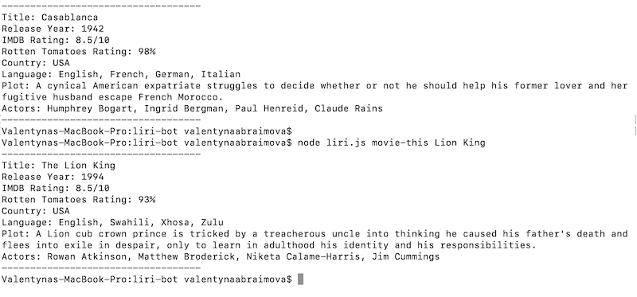
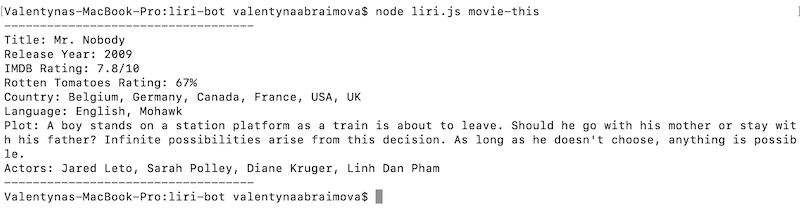
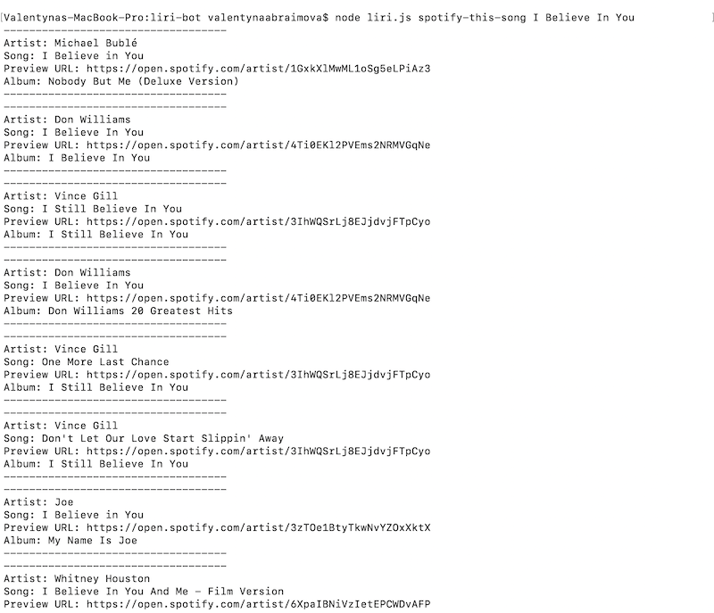
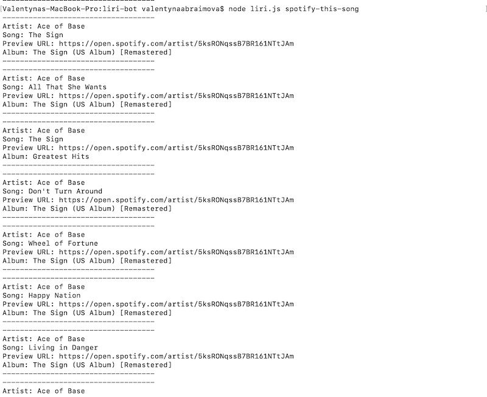
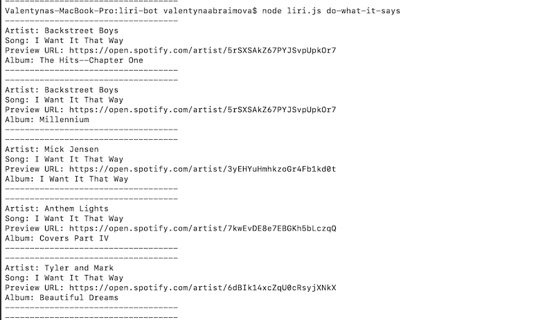

# LIRI BOT

## ABOUT

### Meet LIRI

LIRI is a command line node app that will search Spotify for songs, Bands in Town for concerts, and OMDB for movies.

I used switch statements to call an appropriate API based on user's input.

## TECHNOLOGIES USED

- Node.js
- Axios
- Moment.js
- Spotify API
- OMDB API 
- Bands In Town API

## INSTRUCTIONS

Open the terminal in your root derictory. Once there, run these commands:

>TO CHECK IF YOUR FAVORITE ARTIST HAS A CONCERT COMING UP:
```sh
$ node liri.js concert-this <artist/band name here>
```
>TO GET INFO ABOUT A SONG:
```sh
$ node liri.js spotify-this-song <song name here>
```
>TO GET INFORMATION ABOUT A MOVIE:
```sh
$ node liri.js movie-this <movie name here>
```
>TO GET LIRI RUN THE COMMAND LISTED IN random.txt:
```sh
$ node liri.js do-what-it-says
```
***
### ! IMPORTANT 
Do not wrap the artist, song or movie name in quotes
***
***
### ! IMPORTANT 
To use this application:
- In the root directory, run:
```sh
$ npm install 
```
- Create .env file to hold your Spotify ID and Spotify Secret (get your Spotify credentials by regestering your app on Spotify API's website). 
***

## Examples:

>### Example 1: user is searching for Taylor Swift's concert info
```sh
$ node liri.js concert-this Tylor Swift
```


>### Example 2: user is searching for Drake's concert info, but this artist has no concerts coming up
```sh
$ node liri.js concert-this Drake
```


>### Example 3: user is searching for Casablanca movie info and Lion King movie info
```sh
$ node liri.js movie-this Casablanca
```
...
```sh
$ node liri.js movie-this Lion King
```


>### Example 4: user didn't provide a movie name
>(will search for Mr.Nobody by default)
```sh
$ node liri.js movie-this
```


>### Example 5: user is searching for I Believe in You song info
```sh
$ node liri.js spotify-this-song I Believe in You
```


>### Example 6: user didn't provide a song name
>(will search for "The Sign" by Ace of Base by default)
```sh
$ node liri.js spotify-this-song
```


>### Example 7: user wants LIRI to run the command listed in random.txt 
>(in this case 'spotify-this-song,"I Want it That Way"')
```sh
$ node liri.js do-what-it-says
```


********
WATCH DEMONSTRATION VIDEO HERE

[LIRI BOT Demo]: https://drive.google.com/file/d/1-ZA7oyI-ffCe_U5eszpBdnKdiz2vyP9F/view

********
Try it out and enjoy


